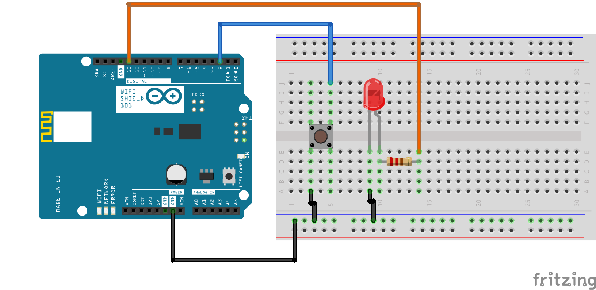

# Using MQTT with the Arduino WiFi Shield 101 and Arduino Cloud

All examples require you to supply your own Arduino Cloud MQTT service credentials. Credentials can be found after logging into the Arduino Cloud portal: [cloud.arduino.cc](https://cloud.arduino.cc)

## Arduino Client

This series of examples is based on [pubsubclient](https://github.com/knolleary/pubsubclient) Arduino Client for MQTT library by Nick O'Leary ([@knolleary](https://github.com/knolleary)).

## (MQTT Send Digital)[mqtt_send_digital]

This example updates the Arduino Cloud MQTT broker service with the status of an LED which is controlled by a pushbutton.

An Arduino WiFi shield 101 is used to connect securely to the broker service using SSL.

To run:

 1. Install the ```PubSubClient``` library using the Arduino IDE library manager (Sketch -> Include Library -> Manage Libraries).
 1. Install the ```WiFi101``` library using the Arduino IDE library manager (Sketch -> Include Library -> Manage Libraries).
 1. Connect the WiFi Shield 101 to your Arduino or Genuino board.
 1. Wire the LED and pushbutton as shown in the diagram below.
 1. Connect your Arduino or Genuino board to your computer using a USB cable.
 1. Open the ``mqtt_send_digital.ino`` sketch in the Arduino IDE.
 1. Update the WiFi settings and MQTT settings in the sketch file.
 1. Upload the sketch to your boards.
 1. Use the Serial Monitor to verify the successful connectivity to the WiFI network and MQTT broker.



When the pushbutton is pressed or released the LED will turn on or off, and also send a message to the MQTT broker to update the topic value.

# [Web UI Client](web-interface)

The Web UI example visualizes the mesages sent by the Arduino MQTT client. It uses the [Paho JavaScript Client library](https://eclipse.org/paho/clients/js/) to connect to the Arduino Cloud MQTT broker service.


To run:

 1. Download the entire ``web-interface`` folder.
 1. Open the ``rcvMqttMsg.js`` file in a text editor.
 1. Update the MQTT settings at the top of the file.
 1. Open ``index.html`` in a Web Browser

An image of a lamp is display on the page, it will update when the pushbutton is pressed and released.


